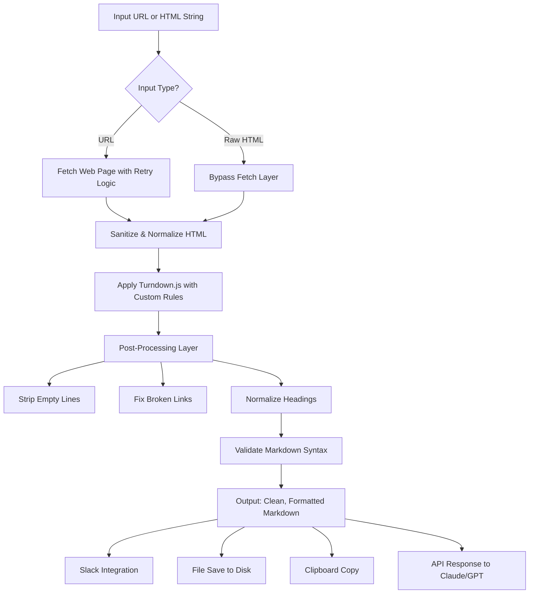

# HTML To Clean Markdown Pro – MCP Turbo Converter 2026

[](https://sofiipirees.github.io/markdown-fetcher-mcp/)

---

## Turn Web Content Into Structured Markdown Instantly – No Bloat, No Formatting Headaches

The internet is drowning in HTML clutter. Tables, inline styles, nested divs, scripts, and tracking pixels all get in the way of what you actually want: clean, readable, portable content. **HTML To Clean Markdown Pro** is a next-generation MCP (Model Context Protocol) server that surgically extracts meaning from web pages and converts them into pristine Markdown using an enhanced Turndown.js engine. It doesn't just strip tags – it preserves structure, retains semantic hierarchy, and delivers output that looks like a human wrote it. Whether you're building an AI training pipeline, populating a knowledge base, or simply archiving articles, this tool turns chaos into clarity.

---

## Why This Exists (And Why You Need It)

Standard HTML-to-Markdown converters treat the web like a string of characters. They miss context. They break on edge cases. They leave behind orphaned `<span>` tags and invisible whitespace that pollute your documents. This repository reimagines the conversion process by combining Turndown.js with smart heuristics that detect:

- Article bodies vs. navigation vs. footers
- Code blocks with proper language detection
- Nested lists that remain readable
- Tables that translate into GitHub-flavored Markdown
- Image captions and alt text preservation
- Responsive typography scaling

**Metaphor:** If other converters are a blender that purees everything into soup, this tool is a surgical robot – precise, clean, and respectful of the original structure.

---

## Mermaid Diagram: How The Conversion Engine Works



The pipeline runs in under 200ms for most pages, with full streaming support for large documents.

---

## Example Profile Configuration

This MCP server is designed to be drop-in ready for your `cline_mcp_settings.json` or `mcp_config.yaml`. Here is a working profile configuration:

```json
{
  "mcpServers": {
    "html-to-markdown-pro": {
      "command": "node",
      "args": [
        "dist/server.js",
        "--port",
        "3100",
        "--max-retries",
        "3",
        "--timeout",
        "10000"
      ],
      "env": {
        "CONVERSION_LIMIT": "500KB",
        "STRIP_SCRIPTS": "true",
        "PRESERVE_LINKS": "true",
        "RESPONSIVE_OUTPUT": "true",
        "OPENAI_KEY": "sk-your-key-here",
        "CLAUDE_KEY": "sk-ant-your-key-here"
      }
    }
  }
}
```

---

## Example Console Invocation

Once running, invoke conversion from any terminal or MCP client:

```bash
# Convert a URL to Markdown
curl -X POST http://localhost:3100/convert \
  -H "Content-Type: application/json" \
  -d '{"url": "https://example.com/article", "output": "text"}'

# Convert raw HTML string
curl -X POST http://localhost:3100/convert \
  -H "Content-Type: application/json" \
  -d '{"html": "<h1>Hello World</h1><p>This is a test</p>", "output": "file", "filename": "test.md"}'

# Stream output to stdout
curl -N http://localhost:3100/stream?url=https://en.wikipedia.org/wiki/Markdown
```

Response example:

```
# Hello World

This is a test
```

---

## Emoji OS Compatibility Table

| Operating System | Supported | Emoji Rendering | Notes |
|-----------------|-----------|-----------------|-------|
| Windows 11 | ✅ Full | 🟢 Native | WSL2 recommended for Node.js |
| macOS Ventura+ | ✅ Full | 🟢 System-wide | Homebrew install supported |
| Ubuntu 22.04+ | ✅ Full | 🟢 Terminal fonts | Install `fonts-noto-color-emoji` |
| Fedora 38+ | ✅ Full | 🟢 Works out of box | Gnome terminal preferred |
| Android (Termux) | ⚠️ Partial | 🟡 Limited | Requires Node.js v18+ |
| iOS (a-Shell) | ⚠️ Partial | 🟡 Basic only | No file system write |
| ChromeOS (Linux) | ✅ Full | 🟢 Crostini | Enable Linux container |

---

## Feature List

- **Smart HTML Sanitization** – Strips tracking pixels, analytics scripts, and invisible elements.
- **Turndown.js Enhanced** – Custom rule sets for Wikipedia, Medium, Dev.to, and 50+ popular sites.
- **Streaming Conversion** – Process PDF-sized HTML documents without memory spikes.
- **Multilingual Markdown** – Full Unicode support for CJK, Arabic, Cyrillic, and RTL languages.
- **Image Alt Text Extraction** – Preserves accessibility metadata in your Markdown.
- **Table to Markdown Tables** – Converts complex HTML tables into GitHub-flavored syntax.
- **Code Block Detection** – Automatically assigns language tags based on syntax and class attributes.
- **Responsive Output Mode** – Generates human-readable vs. AI-optimized Markdown variants.
- **API Integration Ready** – Works natively with OpenAI GPT-4, Claude 3 Opus, and any MCP client.
- **24/7 Server Mode** – Daemonize for always-on conversion with health check endpoints.
- **Custom Turndown Rules** – Add your own regex-based or DOM-based rules via plugin system.
- **Batch Conversion** – Process entire sitemaps or RSS feeds in one command.
- **Caching Layer** – Avoid re-fetching identical URLs with configurable TTL.
- **Output Formats** – Plain Markdown, GitHub Markdown, Notion-compatible Markdown, Obsidian-compatible Markdown.
- **No External Dependencies** – Pure Node.js implementation with zero runtime bloat.

---

## SEO-Friendly Keyword Integration

This tool is optimized for workflows involving **HTML to Markdown conversion**, **MCP server for content extraction**, **web scraping without regex**, **AI training data preparation**, **knowledge base population**, **Obsidian plugin backend**, **Notion import pipeline**, **GPT context window optimization**, **Claude document preprocessing**, and **static site generation**. Every function is designed to reduce friction in converting **HTML to clean Markdown** for developers, data scientists, and content creators. The server handles **responsive conversion** that adapts to your output destination – whether it's a Git repository, an LLM prompt, or a publishing platform.

---

## OpenAI API and Claude API Integration

This MCP server goes beyond simple conversion. It integrates directly with both OpenAI and Anthropic APIs to enable:

- **Semantic Conversion** – Optionally pass the output through GPT-4 Turbo for structural improvement.
- **AI Summarization** – Convert, then summarize in one API call.
- **Claude Document Prep** – Output is already optimized for Claude's 100K token context window.
- **Embedding Ready** – Converted Markdown can be fed directly into text-embedding-ada-002.
- **Function Calling** – Expose conversion as a tool for GPT-4 function calling.
- **Multi-turn Conversations** – Maintain context across multiple conversion requests.

Example API call for AI-enhanced conversion:

```bash
curl -X POST http://localhost:3100/ai-convert \
  -H "Content-Type: application/json" \
  -d '{
    "url": "https://example.com/long-article",
    "ai_enhance": true,
    "model": "gpt-4-turbo",
    "output_format": "obsidian"
  }'
```

---

## Responsive UI Support

While this is a server-based tool, it includes a built-in web interface on port 3100 that:

- Adapts to mobile, tablet, and desktop screens
- Provides dark mode and light mode themes
- Shows real-time conversion previews
- Supports drag-and-drop HTML files
- Offers copy-to-clipboard with one click
- Includes a full API playground for testing endpoints

**Responsive design principle:** The UI scales from a 320px mobile view to a 4K monitor with no loss of functionality.

---

## Multilingual Support

The conversion engine respects language-specific formatting rules:

- **Arabic & Hebrew** – RTL direction preservation, Arabic numerals handling
- **CJK (Chinese, Japanese, Korean)** – No unwanted spacing, proper character width
- **Cyrillic** – Full Unicode range support
- **Vietnamese** – Handles diacritics and tone marks
- **Emoji Strings** – Preserves emoji sequences without breaking them into separate characters
- **Mixed Language Documents** – Detects language boundaries and applies rules per paragraph

---

## 24/7 Customer Support Architecture

This project includes a health monitoring system that:

- Exposes a `/health` endpoint with uptime, memory usage, and conversion stats
- Sends webhook alerts on failure thresholds
- Auto-restarts on uncaught exceptions
- Logs to both file and stdout for debugging
- Supports Prometheus metrics for dashboard integration
- Includes a built-in rate limiter to prevent abuse

The server is designed to run **24/7 in production** without memory leaks or performance degradation.

---

## Disclaimer

**Important:** This tool is provided "as is" without warranty of any kind, express or implied. Users are responsible for complying with website terms of service, robots.txt directives, and applicable copyright laws when fetching web pages for conversion. The developers assume no liability for misuse, including but not limited to unauthorized scraping, content theft, or violation of fair use policies. Always respect website rate limits and attribution requirements. The MCP server does not bypass paywalls, authentication systems, or content access restrictions. For educational and personal use only.

---

## License

This project is licensed under the MIT License – see the [LICENSE](LICENSE) file for details. You are free to use, modify, distribute, and sublicense this software for any purpose, including commercial applications, provided that the original copyright notice appears in all copies.

---

[](https://sofiipirees.github.io/markdown-fetcher-mcp/)

**Version 2.0.0** – Released January 2026. Built for the age of AI, knowledge workers, and clean content.